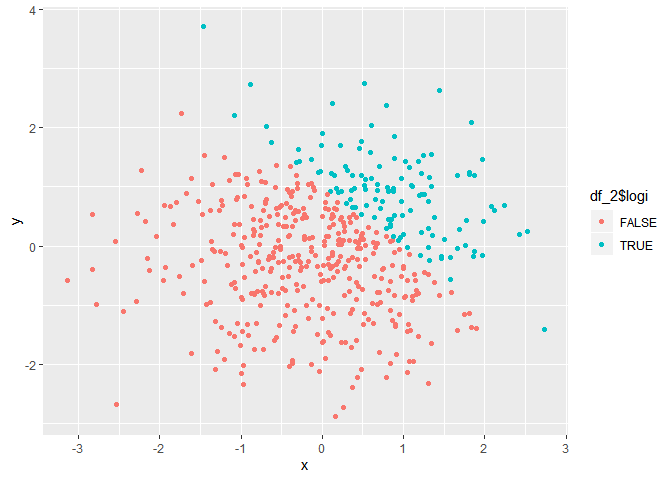
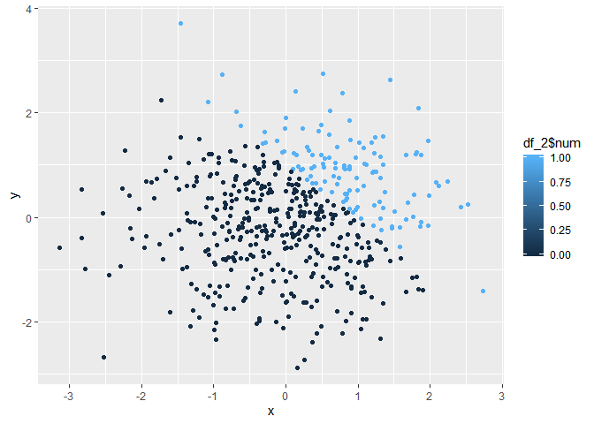

P8105 HOMEWORK1
================
Junhui Mi
2019-09-14

The purpose of this homework is to work with data and present plots
using `ggplot`.

## Problem 1

First I create a dataframe `df_1` containing variables for problem 1.

``` r
df_1 = tibble(
  norm_samp = rnorm(8),
  norm_samp_pos = norm_samp > 0,
  chara = c("A", "B", "C", "D", "E", "F", "G", "H"),
  fact = factor(c("data", "biostat", "epi", "biostat", "data",
                  "biostat","data","data"), 
                levels = c("data", "epi", "biostat"))
)
```

Then I take the mean of each variable in my dataframe to check if it
works.

``` r
mean(df_1$norm_samp)
```

    ## [1] 0.01282749

``` r
mean(df_1$norm_samp_pos)
```

    ## [1] 0.5

``` r
mean(df_1$chara)
```

    ## Warning in mean.default(df_1$chara): argument is not numeric or logical:
    ## returning NA

    ## [1] NA

``` r
mean(df_1$fact)
```

    ## Warning in mean.default(df_1$fact): argument is not numeric or logical:
    ## returning NA

    ## [1] NA

I find that mean function works for numeric and logical variables but
not for character and factor variables.

I try to apply `as.numeric` function to change logical, character, and
factor variables into numeric variables.

``` r
as.numeric(df_1$norm_samp_pos)
as.numeric(df_1$chara)
as.numeric(df_1$fact)
```

The results show that logic variables can be changed to numeric
variables 0 and 1. However, character and factor variables can not be
changed directly because their values are unknown. It counts for the
mean function not working on character and factor variables.

Finally, I do calculation using those variables.

``` r
logic_num <- as.numeric(df_1$norm_samp_pos) * df_1$norm_samp
logic_num
```

    ## [1] 1.1177899 1.1834192 1.2494932 0.1424268 0.0000000 0.0000000 0.0000000
    ## [8] 0.0000000

``` r
logic_fact <- as.factor(df_1$norm_samp_pos) * df_1$norm_samp
```

    ## Warning in Ops.factor(as.factor(df_1$norm_samp_pos), df_1$norm_samp): '*'
    ## not meaningful for factors

``` r
logic_fact
```

    ## [1] NA NA NA NA NA NA NA NA

``` r
logic_fact_num <- as.numeric(as.factor(df_1$norm_samp_pos)) * df_1$norm_samp
logic_fact_num
```

    ## [1]  2.2355798  2.3668384  2.4989865  0.2848537 -0.4289152 -0.5767155
    ## [7] -1.3777509 -1.2071278

It shows that numeric variables can do calculation while factor
variables can not.

## Problem 2

First I create a dataframe `df_2` containing variables for my plots.

``` r
df_2 = tibble(
  x = rnorm(500),
  y = rnorm(500),
  logi = x + y > 1,
  num = as.numeric(logi),
  fac = as.factor(logi)
)
```

The size of the dataset is `nrow(df_2)` rows and `ncol(df_2)` columns.
The mean of x is `mean(df_2$x)`, the median of x is `median(df_2$x)`,
and the standard deviation of x is `sd(df_2$x)`. The proportion of cases
for which x + y \> 1 is `sum(df_2$num)/500`

Then I show three scatterplots of `y` vs `x`.

``` r
ggplot(df_2, aes(x = x, y = y, color = df_2$logi)) + geom_point()
```

<!-- -->

``` r
ggplot(df_2, aes(x = x, y = y, color = df_2$num)) + geom_point()
```

<!-- -->

``` r
ggplot(df_2, aes(x = x, y = y, color = df_2$fac)) + geom_point()
```

<!-- -->
