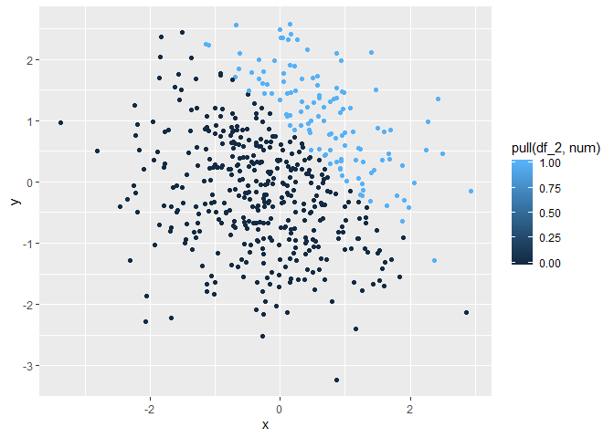

P8105 HOMEWORK1
================
Junhui Mi
2019-09-14

The purpose of this homework is to work with data and present plots
using *ggplot*.

## Problem 1

First I create a dataframe *df\_1* containing variables for problem 1.

``` r
df_1 = tibble(
  norm_samp = rnorm(8),
  norm_samp_pos = norm_samp > 0,
  chara = c("A", "B", "C", "D", "E", "F", "G", "H"),
  fact = factor(c("data", "biostat", "epi", "biostat", "data",
                  "biostat","data","data"), 
                levels = c("data", "epi", "biostat"))
)
```

Then I take the mean of each variable in my dataframe to check if it
works.

``` r
mean(df_1$norm_samp)
```

    ## [1] -0.6404489

``` r
mean(df_1$norm_samp_pos)
```

    ## [1] 0.375

``` r
mean(df_1$chara)
```

    ## Warning in mean.default(df_1$chara): argument is not numeric or logical:
    ## returning NA

    ## [1] NA

``` r
mean(df_1$fact)
```

    ## Warning in mean.default(df_1$fact): argument is not numeric or logical:
    ## returning NA

    ## [1] NA

I find that mean function works for numeric and logical variables but
not for character and factor variables.

I try to apply “as.numeric” function to change logical, character, and
factor variables into numeric variables.

``` r
as.numeric(df_1$norm_samp_pos)
as.numeric(df_1$chara)
as.numeric(df_1$fact)
```

The results show that logic variables can be changed to numeric
variables 0 and 1. However, character and factor variables can not be
changed directly because their values are unknown. It counts for the
mean function not working on character and factor variables.

Finally, I do calculation using those variables.

``` r
logic_num <- as.numeric(df_1$norm_samp_pos) * df_1$norm_samp
logic_num
```

    ## [1] 0.08637983 0.11026925 0.00000000 0.97829578 0.00000000 0.00000000
    ## [7] 0.00000000 0.00000000

``` r
logic_fact <- as.factor(df_1$norm_samp_pos) * df_1$norm_samp
```

    ## Warning in Ops.factor(as.factor(df_1$norm_samp_pos), df_1$norm_samp): '*'
    ## not meaningful for factors

``` r
logic_fact
```

    ## [1] NA NA NA NA NA NA NA NA

``` r
logic_fact_num <- as.numeric(as.factor(df_1$norm_samp_pos)) * df_1$norm_samp
logic_fact_num
```

    ## [1]  0.1727597  0.2205385 -0.3363171  1.9565916 -1.0900193 -1.2789770
    ## [7] -1.4435624 -2.1496603

It shows that numeric variables can do calculation while factor
variables can not.

## Problem 2

First I create a dataframe *df\_2* containing variables for my plots.

``` r
df_2 = tibble(
  x = rnorm(500),
  y = rnorm(500),
  logi = x + y > 1,
  num = as.numeric(logi),
  fac = as.factor(logi)
)
```

The size of the dataset is 500 rows and 5 columns.

The mean of x is 0.0134729, the median of x is 0.0159819, and the
standard deviation of x is 1.0489248.

The proportion of cases for which x + y \> 1 is 0.282

Then I show three scatterplots of *y* vs *x*.

*Plot 1*

``` r
ggplot(df_2, aes(x = x, y = y, color = df_2$logi)) + geom_point()
```

<!-- -->

``` r
ggsave("my first scatterplot for HW1.png")
```

    ## Saving 7 x 5 in image

*Plot 2*

``` r
ggplot(df_2, aes(x = x, y = y, color = df_2$num)) + geom_point()
```

<!-- -->

*Plot 3*

``` r
ggplot(df_2, aes(x = x, y = y, color = df_2$fac)) + geom_point()
```

<!-- -->

The results above shows that:

1)  For all three plots, arrays are divided into two groups: one group
    is “x + y \> 1” and the other is “x + y \<= 1”

2)  ggplot has its color scale for logical variables “TRUE” and “FALSE”,
    which is shown as pink dots and green dots in Plot 1.

3)  ggplot has a gradient color between 0 and 1, from dark blue to light
    blue, as is shown in Plot 2.

4)  If factor variables only contain levels of “TRUE” and “FALSE”, then
    ggplot color scale is same as logical variables, as is shown in Plot
    3.
